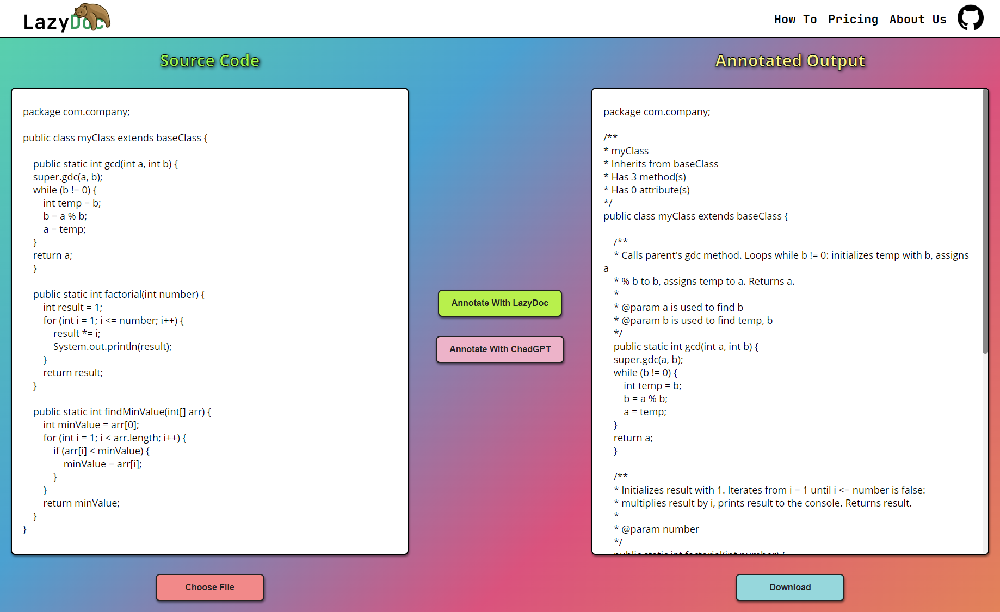

# Lazy Doc
 Our computer engineering senior design project.
 
 Lazy Doc's goal is to create understandable comments for programming languages. At this stage, Lazy Doc is still work in progress and only covers the Java language. It has a web user interface.
 
 